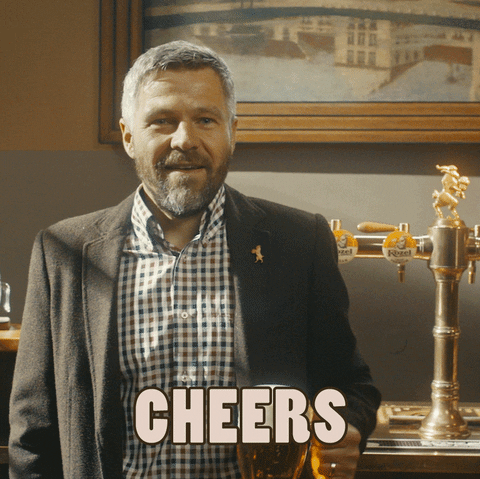

# Hei, jeg er Edward Aarstad 👋

### IT og informasjonssystemer-student | Bachelor i økonomi og administrasjon

---

---

## 🧑‍💻 Om meg

Jeg har en bachelorgrad i økonomi og administrasjon, og studerer nå IT og informasjonssystemer ved Universitet i Agder. Jeg er spesielt interessert i backend-koding, og liker å lære gjennom egne prosjekter.

## 🏆 Utenom studiene

- 🏒 Spiller ishockey for **KSI Crusaders**
- 🥍 Spiller lacrosse for **UiA Studs**

## 🛠️ Teknisk stack

<!-- Legg til/bytt ut badges for språk og verktøy du faktisk bruker -->

## 📫 Ta kontakt

| Plattform | Lenke |
|---|---|
| LinkedIn | [edward-aarstad-822892256](https://www.linkedin.com/in/edward-aarstad-822892256) |
| E-post | [edward@aarstad.com](mailto:edward@aarstad.com) |

---

Sist oppdatert som del av en øvingsoppgave i IS-118

